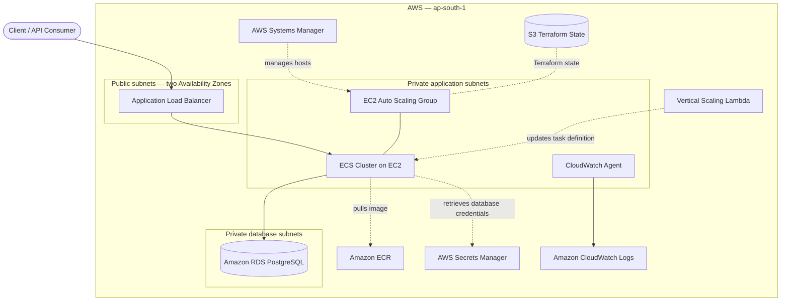

# TaskFlow Architecture

```mermaid
flowchart TB
    User([Client / API Consumer])

    subgraph AWS["AWS — ap-south-1"]
        subgraph Public["Public subnets — two Availability Zones"]
            ALB["Application Load Balancer"]
        end

        subgraph Private["Private application subnets"]
            ECS["ECS Cluster on EC2"]
            ASG["EC2 Auto Scaling Group"]
            CWAgent["CloudWatch Agent"]
        end

        subgraph Database["Private database subnets"]
            RDS[("Amazon RDS PostgreSQL")]
        end

        ECR["Amazon ECR"]
        SM["AWS Secrets Manager"]
        CW["Amazon CloudWatch Logs"]
        SSM["AWS Systems Manager"]
        Lambda["Vertical Scaling Lambda"]
        TFState[("S3 Terraform State")]
    end

    User --> ALB
    ALB --> ECS
    ECS --> RDS
    ECS -. pulls image .-> ECR
    ECS -. retrieves database credentials .-> SM
    ASG --- ECS
    CWAgent --> CW
    SSM -. manages hosts .-> ASG
    Lambda -. updates task definition .-> ECS
    TFState -. Terraform state .- ASG

```

> This diagram represents the intended architecture. Refer to the evidence index for verification status; not every integration shown has been independently verified.
